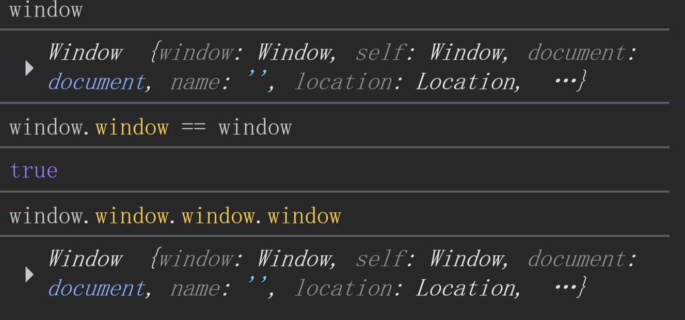
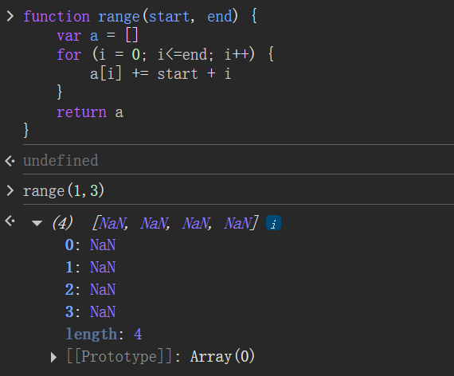
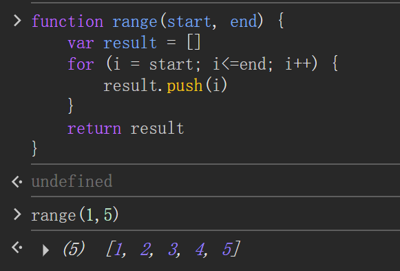
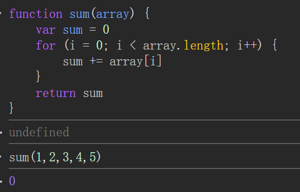
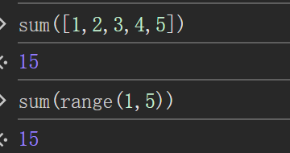
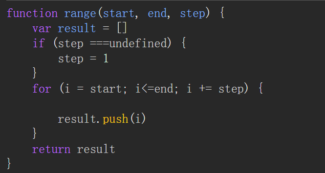
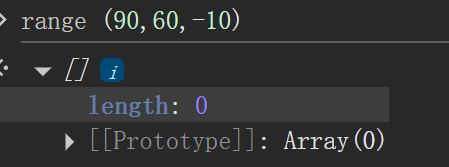

# 2025-04-13-20-31-52-第四章：arguments及剩余参数
```js
funciton foo (a, b, ...c) {
  console.log(a, b, c)
}

foo(1,2,3,4,5)
```
c 是从3到5的数

剩余参数语法
```js
function(a, b, ...restArgs) {

}
```
语法：

- 三点连写
- Rest parameter must be last formal parameter
- Rest parameter 不能有一个默认初始化

单例模式, 即某种对象只有一个(Math)

平方取中法
```js
var a = 56789877
function random() {

  var s = String(a * a)
  var r = s.slice(4, -5)

  a = +r
  return a
}
```
用 cpu 的温度初始化, 然后一直用这个值算

# 2025-04-13-21-31-17-第四章收尾

window 是存储全局变量的对象, 全局变量是 window 的属性



```js
globalThis === window

var foo = 0
foo in window // false
'foo' in window // true
```
in 左边只能是字符串

数组是特殊的对象, 数组的 length 只改变数值下标, 不改变字符串下标

JS 里面一切皆对象

### 4.17 习题



数组应该使用 .push



sum 函数



此时 array 只接收到 1, 而不是整个数组



上面这两种传法才正确



未穿数据为 undefined

但此时若 step 为负数, 就会返回空数组



```js
function range(start, end, step) {
    var result = []
    if (step ===undefined) {
        step = 1
    }
    if (start <= end) {
        for (i = start; i<=end; i += step) {
            result.push(i)
        }
    } else {
        for (i = start; i>=end; i += step) {
            result.push(i)
        }
    }
    
    return result
}
```

反转数组

```js
function reverseArray(array) {
    var result = []
    len = array.length
        for (i = len - 1; i >= 0; i -= 1) {
            result.push(array[i])
        }
    
    return result
}
```

就地反转数组

```js
function reverseArrayInPlace(array) {
    var len = array.length
    
    for (i = 0; i < len; i++) {
        array.unshift(array[2 * i])
    }
    for (i = 0; i < len; i++) {
        array.pop()
    }
    return array
}
```
观察规律可知 `2 * i` 每次都指向原数组的第 `i` 号位置

或者用中间变量做交换

```js
function reverseArrayInPlace(array) {
    var i = 0
    var j = array.length - 1 
    while(i < j) {
      var t = array[i]
      array[i] = array[j]
      array[j] = t
      i++, j--
    }
    return array
}
```
reverseArray 是纯函数, reverseArrayInPlace是副作用函数

# 2025-04-13-22-23-35-leetcode题目讲解

### 485. 最大连续一的个数

https://leetcode.cn/problems/max-consecutive-ones/

```js
var findMaxConsecutiveOnes = function (nums) {
    var ones = 0
    var max = -Infinity
        for (var i = 0; i <= nums.length; i++) {
            if (nums[i] == 1) {
                ones++
            } else {
                if (max < ones) {
                    max = ones
                }
                ones = 0
            }
        }
    return max
}
```
`i <= nums.length` 是为了让 `max` 与 `ones` 做比较, 否则即使最后 `ones` 比 `max` 大, `ones` 的值也不能和 `max` 交换.

如果想要去掉 `=` 号, 把第二个 `if` 挪到第一个 `if` 里就行了
```js
var findMaxConsecutiveOnes = function (nums) {
    var ones = 0
    var max = -Infinity
        for (var i = 0; i < nums.length; i++) {
            if (nums[i] == 1) {
                ones++
                if (max < ones) {
                    max = ones
                }
            } else {
                ones = 0
            }
            
        }
    return max
};
```

重点: 遇到 1 就加加, 遇到 0 就重置

### 263. 丑数

https://leetcode.cn/problems/ugly-number/description/

```js
var isUgly = function(n) {
    while ((! (n % 2)) && n != 1 && n != 0) {
        n = n / 2 
    }
    while ((! (n % 3)) && n != 1 && n != 0) {
        n = n / 3 
    }
    while ((! (n % 5)) && n != 1 && n != 0) {
        n = n / 5 
    }
    if (n == 1) {
        return true
    } else {
        return false
    }

};
```
其实 `while` 中的 `n != 1` 可以去掉

注意: 0 不是丑数

### 461. 汉明距离

https://leetcode.cn/problems/hamming-distance/description/

两个整数之间的 **汉明距离** 指的是这两个数字对应二进制位不同的位置的数目.

给你两个整数 x 和 y，计算并返回它们之间的汉明距离.

我的想法: 十转二转string / 数组再循环，但是怎么转呢？有语法糖吗？还是所有语言通用？长度怎么弄？

法一: 不转换, 通过模二的方法取出各位比较
```js
var hammingDistance = function(x, y) {
    var count = 0
    while(x > 0 || y > 0) {
        var d1 = x % 2
        var d2 = y % 2
        if (d1 != d2) {
            count++
        }
        x = (x - x % 2) / 2
        y = (y - y % 2) / 2
    }
    return count
};
```

### 504. 七进制数

https://leetcode.cn/problems/base-7/description/

给定一个整数 `num`，将其转化为 7 进制，并以字符串形式输出。

```js
var convertToBase7 = function(num) {
    var result = ''
    var sign = 1
    if (num < 0) {
        sign = -1
        num = -num
    }
    do {
        result = num % 7 + result
        num = (num - num % 7) / 7
    } while (num > 0)

    if (sign == -1) {
        return '-' + result
    } else {
        return result
    }
};
```

注意：
- `do-while` 循环退出的条件是 `num > 0`而不是 `num >= 7`, 因为当 `0 < num < 7` 时, 还需再进行一步才能取出最后一位.
- 是`result = num % 7 + result` 不是 `result = result + num % 7` 因为第一次的余数在末尾

###  204. 计数质数

https://leetcode.cn/problems/count-primes/description/

给定整数 `n`，返回所有小于非负整数 `n` 的质数的数量.

```js
var countPrimes = function(n) {
    var count = 0
    
    for (var i = 1; i < n; i++) {
        if (isPrime(i)) {
            count++
        }
    }

    function isPrime(n) {
        if (n < 2) {
            return false
        }
        var sqrt_n = Math.floor(Math.sqrt(n))
        for (var j = 2; j <= sqrt_n; j++) {
            var mod = n % j
            if (mod == 0) {
                return false
            } 
        }
        return true
    }
    
   return count
};
```

用这个方法过不了, 因为超时了, 现在用**建立映射**的方法

```js
var prime = new Array(50000).fill(-1)
var countPrimes = function(n) {
    var count = 0
    
    for (var i = 1; i < n; i++) {
        if (isPrime(i)) {
            count++
        } 
    }

    function isPrime(n) {
        if (prime[n] == 0) {
            return false
        } else if (prime[n] == 1) {
            return true
        }

        if (n < 2) {
            prime[i] = 0
            return false
        }

        var sqrt_n = Math.floor(Math.sqrt(n))
        for (var j = 2; j <= sqrt_n; j++) {
            var mod = n % j
            if (mod == 0) {
                prime[i] = 0
                return false
            } 
        }
        prime[i] = 1
        return true
    }
    
   return count
};
```
